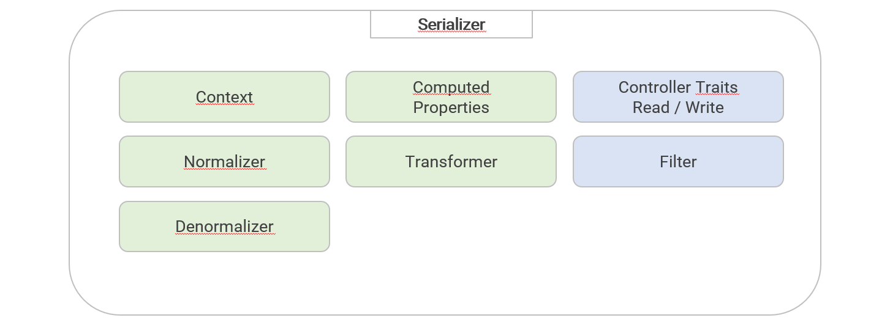

# Architecture Overview

The following architecture overview shows all available components of the bundle. 
Most of the components can be configured in the ``daves_weblab_rest`` configuration node. For
more details see [Configuration](./03_Configuration.md).

For details on a given component see the following documentation pages:
- [Contexts](./09_Contexts.md)
- [Normalizers](./10_Normalizers.md) and [Transformers](./11_Transformers.md) 
- [Denormalizers](./12_Denormalizers.md)
- [Computed Properties](./05_Computed-Properties.md)
- Controller Traits for [Read](./13_Controller-Trait-Read.md) and [Write](./14_Controller-Trait-Write.md)
- [Filters](./06_Api-Filters.md)